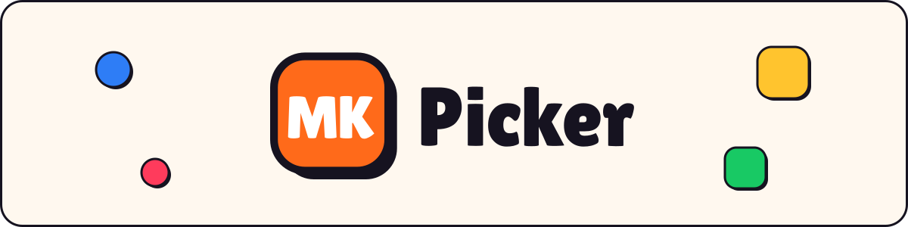

 

**Finish the race, read the ballot, and MKPicker tells you which track to vote for**

 

<table align="center">
  <tr>
    <td align="right"><b>🎮 Frontend</b></td>
    <td>
      
      
      
      
      
    </td>
  </tr>
  <tr>
    <td align="right"><b>⚙️ Backend</b></td>
    <td>
      
      
      
      
      
      
      
    </td>
  </tr>
  <tr>
    <td align="right"><b>🚀 Hosting</b></td>
    <td>
      
      
    </td>
  </tr>
</table>

## 🏁 Come Race Ready!

Every online lobby runs the same loop:

1. Race
2. Vote on the next track
3. Race again.

MKPicker sits in the gap between the races. Mario Kart 8 treats your **finishing position** from the last race as
your spot on the **next starting grid**. MKPicker takes that starting position, and ranks the three tracks on the ballot by how well each one plays from there.

|     | Lap                       | What happens                                                                                                       |
| :-: | :------------------------ | :----------------------------------------------------------------------------------------------------------------- |
| 🏎️  | **Where did you finish?** | Pick P1 through P12.                                                                                               |
| 🗳️  | **What's on the ballot?** | Search-and-add the three tracks from any of the 96 courses.                                                        |
| 🏆  | **Get the verdict**       | A recommended pick with a 0–100 pick score, the runners-up, and a plain-English reason for each.                   |
| 📻  | **Log the winner**        | The lobby doesn't always vote your way! Tell MKPicker which track actually won and get that track's pre-race tips. |

Two tabs live in the app:

- **Browse** — the full catalog of 96 courses across 24 cups, filterable by name and 10+ traits!
- **Track Picker** — the flagship feature! Find which track best suits your position. A four-phase flow: `input` → `loading` → `ranked` → `tips`.

There is a settings panel with some accessibility features.

## 🧠 Under the Hood

The recommender (`backend/recommender.py`) is rule-based, not learned. A track's score is a **graded position-band fit** with small adjustments based on traits.

**🎯 Band fit:** Every track carries at least one `Strategy` with a starting-grid band
`[position_min, position_max]`. Inside the band the fit is a perfect `1.0`; outside it decays
linearly to `0` over `FALLOFF` positions.

**🍄 Trait lean.** Each track is tagged with traits, and each trait leans toward the front or the
back of the grid. The signed sum is the track's _lean_; it's multiplied by how far back you're
starting, so a chaos track scores higher from P12 and a clean-lines track scores higher from P1.
`TRAIT_BONUS_WEIGHT = 0.15` keeps this subordinate to band fit — traits break ties, they never
override the band.

## 🗺️ The Data Model

Two SQLite tables

**`tracks`** — one row per course

| Column         | Type      | Notes                                                                                                                                   |
| :------------- | :-------- | :-------------------------------------------------------------------------------------------------------------------------------------- |
| `id`           | int       | Primary key; ids 1–48 are base game, 49–96 are DLC                                                                                      |
| `name`, `cup`  | str       | e.g. `Sweet Sweet Canyon`, `Mushroom Cup`                                                                                               |
| `laps`         | int       |                                                                                                                                         |
| `header_color` | str       | A design-token reference like `var(--boost-500)` — colors live in CSS, not in Python                                                    |
| `description`  | str       | The flavor blurb on the Browse card                                                                                                     |
| `terrain`      | str       | Slippery off-road class: `"None"`, `"Sand"` or `"Ice"`. Drives the Browse badge and filter only — the recommender doesn't read it (yet) |
| `traits`       | JSON list | Tags from the nine-trait vocabulary above                                                                                               |
| `dlc`          | bool      | Booster Course Pass track — shows the DLC pill                                                                                          |

  

**`strategies`** — 1-2 rows per track

| Column                         | Type             | Notes                                                 |
| :----------------------------- | :--------------- | :---------------------------------------------------- |
| `track_id`                     | FK → `tracks.id` |                                                       |
| `position_min`, `position_max` | int              | The starting-grid band this plan is built for         |
| `tips`                         | JSON list        | The short, actionable tips shown on the `tips` screen |

## 🏆 Grand Prix Standings — Roadmap

<b>🏁 Cup 1 — Development</b> (complete)

> 

> 
Browse Tab

>
> - [x] UI
> - [x] Seed track table with information contained on each track card
> - [x] Remove template cards, link backend so cards contain real information
>   - mushroom cup only is in right now, after testing, full list will go in
> - [x] Add dlc status
> - [x] Seed the remaining tracks
>   - all 24 cups / 96 courses via `seed_all.py`; also fills out the terrain filter with real Sand/Ice grades
>
> 

> 

> 
Track Picker

>
> - [x] UI
> - [x] Seed strategies table
>   - with demo tracks so far
> - [x] Develop rule based algo
>   - [x] weigh in track traits to break ties
> - [x] Pre racing tips & tricks page
>
> 

> 

> 
Deployment

>
> - [x] finalize app
>   - [x] delete unused files
> - [x] fix lint errors
> - [x] remove ngrok from vite config
> - [x] add health check endpoint
> - [x] research deployment options
> - [x] make CORS origins configurable (`ALLOWED_ORIGINS` env var) for a deployed frontend host
> - [x] ship the seeded database with the repo instead of gitignoring it
> - [x] deploy backend and frontend
> - [x] make deployment adjustments
>
> 

<b>⭐ Cup 2 — Post-Deployment</b> (in progress)

> 

> 
Settings

>
> - [x] add settings panel
>   - [x] add dark mode
>     - [x] add dark mode palette
>     - [x] add switch in panel
>
> 

> 

> 
Footer

>
> - [x] add footer
>   - [x] data collection disclosure (or lack of)
>
> 

> 

> 
Mobile

>
> - [ ] add mobile portrait mode support
>   - (WIP)
>
> 

  

MKPicker is a fan-made project and is not affiliated with or endorsed by
Nintendo.

